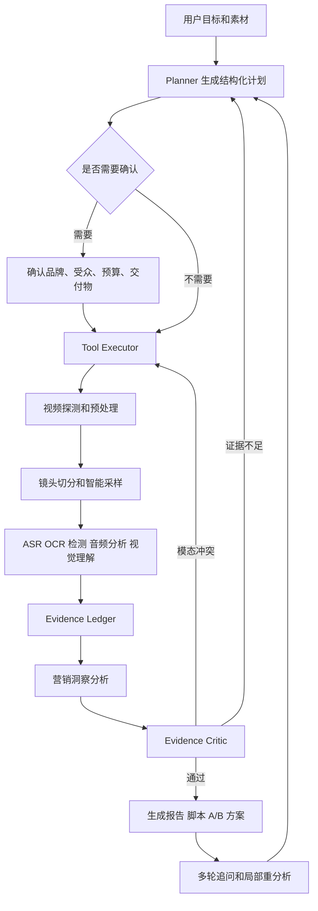
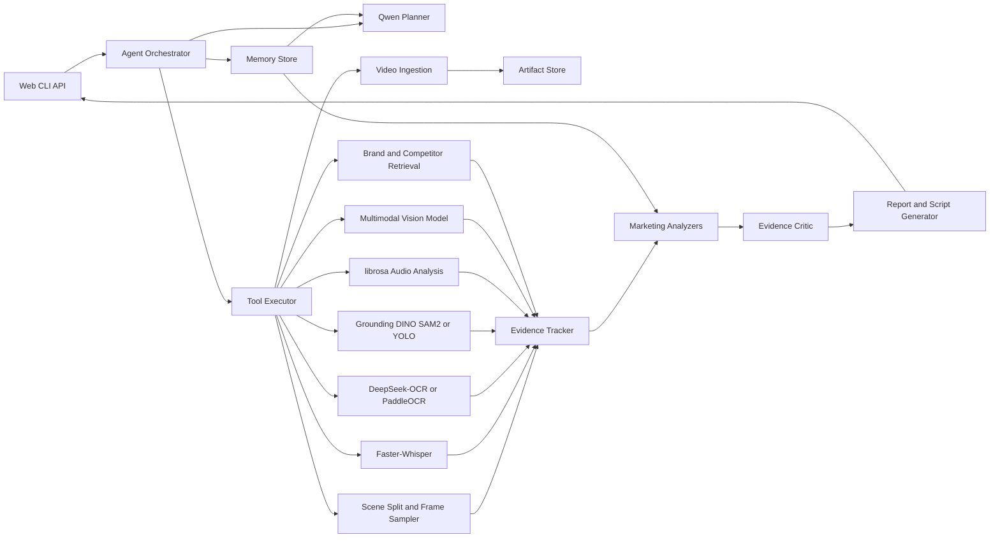

# AdVista Insight Agent 项目方案

## 1. 项目边界

新项目路径：仓库根目录

原项目：早期竞赛实现（不包含在本仓库中）

本项目是独立工程，不直接修改原比赛项目。原项目仅作为设计和实现参考，后续如需迁移代码，应按模块复制并重构，同时保留来源说明和测试，不能让新系统继续依赖比赛数据目录、固定样本数量或提交格式。

## 2. 项目定位

推荐名称：**AdVista Insight Agent**

中文名称：**AdVista 多模态广告洞察与营销决策智能体**

一句话定位：

> 使用专用感知模型解析广告视频，以 Qwen3.5-9B 负责规划、跨模态营销推理、证据审校和交付物生成，输出可追溯的卖点、受众、痛点、创意结构、转化路径、优化建议和新版脚本。

系统不只回答“视频里有什么”，还应回答：

- 广告在向谁销售；
- 解决了什么用户痛点；
- 使用了哪些卖点和证明方式；
- Hook、Problem、Solution、Proof、Offer、CTA 是否完整；
- 每个结论由哪段画面、字幕或口播支持；
- 下一版素材应该如何修改和进行 A/B 测试。

## 3. 原项目诊断

原 AdVista 是一个可复现性较好的比赛推理流水线：

```text
问题 JSONL + id.mp4
  -> Faster-Whisper ASR
  -> Qwen 问题相关视觉事实
  -> Qwen 首轮编号答案
  -> Qwen 保守审校
  -> 比赛提交 JSONL
```

### 3.1 可复用能力

| 原模块 | 可复用能力 | 新项目处理方式 |
|---|---|---|
| `client.py` | OpenAI 兼容异步请求、重试、多服务轮询 | 重构为 `runtime/model_client.py` |
| ASR 服务 | Faster-Whisper 服务化 | 重构为标准工具适配器 |
| ASR 清洗 | 时间片段合并、去重、截断 | 输出统一 Evidence Schema |
| Vision 清洗 | 去重、过滤推测性描述 | 扩展为证据质量规则 |
| Postprocess Guard | 风险词、数字、促销条件守卫 | 升级为 Evidence Critic |
| Preflight | 模型和服务健康检查 | 扩展到全部工具 |
| Manifest/Fingerprint | 模型、Prompt、输入和产物溯源 | 用于运行记录和内容寻址缓存 |
| Resume | 批处理断点续跑 | 迁移到任务状态和 Artifact Store |

### 3.2 不应延续的比赛绑定

- 固定 `expected_items=3108`；
- 输入必须是 `{id, question}` JSONL；
- 视频必须命名为 `{id}.mp4`；
- Vision 证据只能服务于一个问题；
- 英文编号列表和最多四点输出；
- Prompt 中的 point-level F1 比赛评分目标；
- 最终只输出 `{id, model_prediction}`；
- 同一个视频重复进行三次完整 Qwen 视频推理。

### 3.3 当前 Agent 能力判断

原项目拥有工具调用、生成后审校和规则守卫的雏形，但实际执行路径由 CLI 和 Shell 脚本固定，不具备目标驱动的动态规划、工具选择、记忆、状态机、多轮任务延续和自动交付物选择。因此它本质上是固定 Pipeline，不是真正的 Agent。

## 4. 模型与工具分工

核心原则：**专用模型负责感知，Qwen3.5-9B 负责认知和决策。**

### 4.1 专用工具推荐

| 任务 | 首选方案 | 备选方案 | 输出要求 |
|---|---|---|---|
| ASR | Faster-Whisper large-v3-turbo | WhisperX | 片段、词级时间戳、语言、置信度 |
| OCR | DeepSeek-OCR | PaddleOCR | 文本、帧时间戳、区域坐标、置信度 |
| 镜头切分 | PySceneDetect | TransNetV2 | shot id、起止时间、关键帧 |
| Logo/开放词汇检测 | Grounding DINO + SAM2 | YOLO/品牌分类器 | 类别、bbox、时间、置信度 |
| 商品识别 | 多模态模型 + 检索 | CLIP/SigLIP | 商品候选、相似度、证据帧 |
| 音乐 BPM | librosa | Essentia | BPM、节拍点、能量曲线 |
| 音频情绪 | 音频分类模型 | 规则特征 | 情绪、强度、时间区间 |
| 视频解码 | FFmpeg/PyAV | OpenCV | 标准帧、音轨、视频元数据 |
| 精确时间定位 | 统一时间轴对齐器 | WhisperX forced alignment | Evidence 与视频毫秒时间对齐 |
| 向量检索 | pgvector/Qdrant | FAISS | 品牌、商品、历史广告检索结果 |

DeepSeek-OCR 应封装成可替换工具，不把其接口写死在业务逻辑中。对于部署成本受限的环境，可以切换到 PaddleOCR。OCR 工具必须保留文本所在帧、时间戳、区域和模型置信度，仅保留纯文本无法形成可靠证据链。

### 4.2 Qwen3.5-9B 角色

适合承担：

- 用户意图识别和任务规划；
- 根据任务选择工具并生成参数；
- 跨模态结构化信息融合；
- 卖点、痛点、目标受众和营销逻辑推理；
- Hook、Problem、Solution、Proof、Offer、CTA 分析；
- 证据充分性检查和冲突解释；
- 多轮问答；
- 报告、脚本和 A/B 测试方案生成。

不应让 Qwen3.5-9B 单独承担：

- 精确语音转写；
- 高精度文字识别；
- 像素级检测和分割；
- 视频编解码；
- 精确帧时间定位；
- 音乐节拍计算。

如果当前 Qwen3.5-9B 权重支持多模态，可以向其提供少量精选关键帧和结构化时间轴。如果使用纯语言版本，应先由视觉模型生成结构化视觉事件，再由 Qwen 完成规划、融合推理和报告。

## 5. 用户任务

| 用户 | 上传内容 | Agent 交付物 | 支持的决策 |
|---|---|---|---|
| 广告投放优化师 | 广告视频、CTR/CVR/完播率 CSV | 素材诊断、指标关联、A/B 方案 | 扩量、停投、改 Hook 或 CTA |
| 品牌市场人员 | 视频、品牌手册、商品资料 | 品牌一致性、受众和传播策略报告 | 传播口径和创意方向 |
| 电商运营 | 商品视频、详情页、评论 | 卖点表、异议表、口播和转化脚本 | 商品页和短视频内容优化 |
| 内容创作者 | 样片、参考视频、创作 Brief | 分镜、开头候选、文案和节奏建议 | 下一版视频如何制作 |
| MCN/代理公司 | 批量素材、客户 Brief、竞品素材 | 创意聚类、批量评分、客户报告 | 素材矩阵和提案方向 |
| 研究者/开发者 | 视频集、标注、模型服务 | Benchmark、消融实验和结构化数据 | 模型与工具选型 |

## 6. Agent 工作流

Agent 采用 `Goal -> Plan -> Act -> Observe -> Ground -> Reflect -> Deliver` 循环。



### 6.1 任务规划

Planner 输出 `AnalysisPlan`，至少包含：

- 用户目标；
- 需要的工具；
- 工具依赖关系；
- 快速或深度分析预算；
- 需要用户确认的项目；
- 目标交付物；
- 最大调用次数和超时。

### 6.2 工具协议

每个工具实现统一接口：

```python
class Tool:
    name: str
    description: str
    input_schema: dict
    output_schema: dict

    async def run(self, context, arguments): ...
```

工具执行器负责：

- 参数 Schema 校验；
- 依赖检查；
- 并发和异步调度；
- 超时、重试和熔断；
- Artifact 缓存；
- 调用日志和成本记录；
- 错误转换和 fallback。

### 6.3 人机协同

需要用户确认：

- 品牌事实和商品规格冲突；
- 医疗、功效、安全和绝对化声明；
- 目标用户不明确；
- 竞品来源存在歧义；
- 最终对外发布的脚本。

可以自动完成：

- 视频解码和抽帧；
- ASR、OCR 和镜头切分；
- 初步卖点和结构分析；
- 证据索引；
- 报告草稿；
- 批量统计和缓存复用。

## 7. 证据链设计

所有工具结果进入统一 Evidence Ledger，不能只把非结构化文本拼进 Prompt。

### 7.1 Evidence Schema 示例

```json
{
  "evidence_id": "ev_000018",
  "asset_id": "asset_001",
  "modality": "ocr",
  "start_ms": 4200,
  "end_ms": 6100,
  "frame_path": "artifacts/asset_001/frames/004800.jpg",
  "region": [0.12, 0.68, 0.84, 0.91],
  "content": "30-day money-back guarantee",
  "confidence": 0.93,
  "tool": "deepseek_ocr",
  "model_version": "configured-version",
  "artifact_hash": "sha256:..."
}
```

### 7.2 Insight Schema 示例

```json
{
  "insight_id": "insight_007",
  "type": "selling_point",
  "claim": "广告通过退款承诺降低首次购买风险",
  "evidence_ids": ["ev_000018", "ev_000026"],
  "confidence": 0.88,
  "epistemic_status": "inferred_from_ad",
  "unsupported": false
}
```

`epistemic_status` 至少区分：

- `observed`：画面或文本直接可见；
- `stated_by_ad`：广告口播或文案声称；
- `inferred_from_ad`：基于直接证据的营销推断；
- `retrieved_knowledge`：来自品牌或行业知识库；
- `unknown`：证据不足。

### 7.3 Critic 检查

- 每个核心 Insight 是否至少有一条有效证据；
- 是否把广告声明写成客观事实；
- ASR、OCR 和视觉证据是否冲突；
- 时间戳和帧引用是否存在；
- 新增数字、价格、规格和促销条件是否有来源；
- 是否存在品牌合规和高风险词；
- 低置信度结论是否明确标记。

## 8. 系统架构



## 9. 核心模块

| 模块 | 职责 |
|---|---|
| Video Ingestion | 输入校验、媒体探测、音轨提取、内容哈希 |
| Frame Sampler | 镜头边界、关键帧、OCR 密集帧、商品变化帧 |
| ASR/OCR Parser | 时间戳文本、区域、语言、置信度 |
| Detection Tools | Logo、商品、人物和开放词汇检测 |
| Audio Analyzer | BPM、节拍、能量和情绪变化 |
| Evidence Tracker | 统一时间轴、来源、置信度和 Artifact 引用 |
| Selling Point Analyzer | 功能、利益点、用户价值和证明方式 |
| Audience Analyzer | 目标用户、痛点、需求和异议 |
| Creative Analyzer | Hook、叙事、镜头、情绪、Proof、Offer、CTA |
| Agent Planner | 根据目标选择工具、预算和交付物 |
| Tool Executor | 调度、缓存、重试、日志和 fallback |
| Evidence Critic | 证据支持、冲突、风险和完整性检查 |
| Memory Store | 品牌、历史广告、行业知识、会话和用户偏好 |
| Report Generator | JSON、Markdown、HTML/PDF、CSV 和脚本 |
| Acceleration Engine | 模型路由、智能采样、缓存、批处理和量化 |

## 10. 项目目录

```text
AdVista-Agent/
├── ad_vista_agent/
│   ├── agent/
│   │   ├── orchestrator.py
│   │   ├── planner.py
│   │   ├── critic.py
│   │   └── state.py
│   ├── schemas/
│   │   ├── assets.py
│   │   ├── evidence.py
│   │   ├── insights.py
│   │   └── reports.py
│   ├── tools/
│   │   ├── registry.py
│   │   ├── video.py
│   │   ├── asr.py
│   │   ├── ocr.py
│   │   ├── detection.py
│   │   ├── audio.py
│   │   ├── vision.py
│   │   └── retrieval.py
│   ├── analyzers/
│   │   ├── selling_points.py
│   │   ├── audience.py
│   │   ├── creative.py
│   │   └── conversion.py
│   ├── evidence/
│   │   ├── ledger.py
│   │   └── alignment.py
│   ├── memory/
│   │   ├── session.py
│   │   ├── brand.py
│   │   └── vector_store.py
│   ├── reports/
│   │   ├── generator.py
│   │   └── templates/
│   ├── runtime/
│   │   ├── model_client.py
│   │   ├── scheduler.py
│   │   ├── cache.py
│   │   └── telemetry.py
│   └── services/
├── configs/
├── docs/
├── examples/
├── ad_vista_agent/resources/
├── scripts/
├── tests/
└── outputs/
```

## 11. Memory 和 RAG

### 11.1 短期记忆

- 当前用户目标；
- 分析计划和执行状态；
- 已生成 Evidence 和 Insight；
- 用户确认、修订和否决记录；
- 当前交付物版本。

### 11.2 长期记忆

- 品牌手册、禁用词和语气；
- 商品规格和合法声明；
- 历史广告、分析报告和用户反馈；
- 行业创意案例；
- 广告平台规范；
- 竞品公开资料；
- 用户偏好的报告结构和分析深度。

MVP 使用 SQLite 保存元数据和任务状态，使用 FAISS 或轻量本地向量库。服务化阶段使用 PostgreSQL + pgvector 或 Qdrant。

RAG 只提供背景知识，不能覆盖原视频证据。发生冲突时采用：

```text
清晰原始视频证据 > 经验证的商品/品牌资料 > 检索知识 > 自动模型推断
```

## 12. 推理加速

### 12.1 当前已知瓶颈

- 原项目同一视频进行三次 Qwen 视频调用；
- 多模态缓存被禁用；
- Prefix Cache 被禁用；
- 视频整体送入模型，缺少镜头级智能采样；
- ASR 单模型全局锁导致串行；
- 最长 12,000 字符 ASR 直接进入上下文；
- 每完成一条结果重写整个 JSONL。

### 12.2 推荐部署

| 硬件 | Qwen 部署 | 量化 |
|---|---|---|
| H20/A100 80GB 及以上 | vLLM | BF16 优先 |
| RTX 4090/3090 24GB | vLLM 或 SGLang | AWQ INT4 |
| CPU/低资源本地 | llama.cpp，仅承担语言规划和报告 | GGUF Q4/Q5 |
| 固定 NVIDIA 高吞吐服务 | 稳定后评估 TensorRT-LLM | FP8/INT8/INT4 按评测选择 |

当前工程首选继续使用 vLLM，因为原项目已经拥有可工作的 OpenAI 兼容服务和异步客户端。

### 12.3 优化动作

1. 将通用视频解析从三次降为一次，后续推理只读取 Evidence Ledger。
2. 按镜头边界、OCR 变化、画面差异、商品出现和固定时间间隔联合采样。
3. 使用 `video_hash + tool + model_version + prompt_version + params` 作为缓存键。
4. 对固定 Planner/Critic Prompt 开启 Prefix Cache。
5. 为多模态预处理配置合理缓存，不再固定为 0。
6. 使用 vLLM continuous batching、chunked prefill 和 paged KV cache。
7. 将 ASR/OCR/视频工具流水线并行化。
8. 使用分镜摘要、视频摘要、营销摘要三级上下文压缩。
9. 对长度相近的请求分桶，避免短任务被长视频阻塞。
10. 使用任务级 Artifact 文件或数据库，不在每个样本结束时重写完整 JSONL。

### 12.4 Benchmark 指标

- 预处理、ASR、OCR、视觉和报告分阶段耗时；
- TTFT、输出 tokens/s；
- P50/P95 端到端延迟；
- 峰值显存和 GPU 利用率；
- 单视频成本和批量吞吐；
- 缓存命中率；
- JSON Schema 通过率；
- Evidence Precision/Recall；
- Selling Point F1；
- BF16、INT8、AWQ INT4 的质量差异。

### 12.5 目标值

以下仅是开发验收目标，完成实测前不能写成项目成果：

- Qwen 完整视频调用从 3 次降到 1 次；
- 重复追问不重复解析视频；
- 重复分析缓存命中率大于 80%；
- 结构化输出合法率大于 98%；
- 批量吞吐提升 1.5 至 2 倍；
- AWQ INT4 核心字段 F1 相比 BF16 下降不超过 2 个百分点。

## 13. MVP 功能

第一版必须具备：

- 任意广告视频上传；
- 视频探测、镜头切分和智能关键帧；
- Faster-Whisper ASR；
- DeepSeek-OCR 或 PaddleOCR 可切换；
- 商品、品牌和露出分析；
- 卖点、用户痛点和目标人群分析；
- Hook、镜头节奏、文案、情绪和转化路径分析；
- Evidence ID、时间戳和帧引用；
- Evidence Critic；
- 优化建议、新版脚本和 A/B 方案；
- Markdown/HTML/JSON 报告；
- 基于已有证据的多轮问答；
- 小批量视频分析。

第一版暂不实现：

- 全网广告自动爬取；
- 大规模多租户平台；
- 自动投放和预算控制；
- 自训练 Logo 检测模型；
- 大规模 LoRA 训练；
- 复杂归因模型。

## 14. 分阶段开发计划

> 2026-08-12 状态说明：早期表格是立项时的粗粒度计划。实际工程按可验证边界拆分，当前已完成 Stage 1-8、Stage 9 第一版 Agent Core 和 Stage 10 第一版多轮会话。Web、长期偏好记忆、局部重分析、脚本和 A/B 生成仍未完成，不能写成现有能力。

| 阶段 | 具体任务 | 验收标准 | 预计耗时 |
|---|---|---|---|
| 1 工程与 Schema | pyproject、配置、Asset/Evidence/Insight/Report、CLI | 任意视频可建立任务 | 2 天 |
| 2 多模态解析 | FFmpeg、镜头切分、ASR、OCR、关键帧 | 输出统一时间轴 Evidence JSON | 4 天 |
| 3 Agent | Planner、Registry、Executor、状态机 | 根据目标生成不同工具计划 | Stage 9 第一版已完成 |
| 4 洞察与证据 | 营销 Analyzer、Critic、证据引用 | 每个核心结论可定位视频片段 | 4 天 |
| 5 交互与报告 | Web、进度、多轮问答、HTML 报告 | 上传到导出完整可演示 | 3 天 |
| 6 加速 | 缓存、采样、批处理、量化 | 生成性能对比报告 | 3 天 |
| 7 开源包装 | README、案例、Demo、架构图、简历材料 | 新用户可按文档运行 | 2 天 |

### 14.1 实际 Stage 进度

| 实际阶段 | 状态 | 已实现能力 |
|---|---|---|
| Stage 1 | 已完成 | 视频接入、内容哈希、Asset/Run、FFprobe |
| Stage 2 | 已完成 | 镜头切分、关键帧、统一时间轴 |
| Stage 3 | 已完成 | Faster-Whisper 时间戳语音 Evidence |
| Stage 4 | 已完成 | DeepSeek-OCR 与 PaddleOCR fallback |
| Stage 5 | 已完成 | Evidence Ledger、OCR 聚类、关系构建 |
| Stage 6 | 已完成 | Qwen3.5-9B 结构化洞察、引用和置信度守卫 |
| Stage 7 | 已完成 | 确定性 Critic、Markdown/HTML 报告 |
| Stage 8 | 已完成 | 固定流水线的一键编排、恢复、人工确认 |
| Stage 9 Agent Core | 第一版已完成 | Goal、Qwen/规则 Planner、计划编译、工具白名单、Act/Observe、Reflection、预算、会话恢复、人工门 |
| Stage 10 多轮与记忆 | 第一版已完成 | SQLite 会话消息、回答版本、用户反馈、基于既有 Artifact 的引用追问；不重跑 ASR/OCR |
| Stage 11 创作交付物 | 第一版已完成 | 基于既有 Ledger/洞察生成带引用的 Hook、脚本、分镜和 A/B 方案 |
| Stage 12 Web 产品化 | 第一版已完成 | 本地上传、后台进度、时间轴、对话和报告/创作导出界面 |

### 14.2 Stage 9 Agent Core 边界

Stage 9 第一版已经从固定流水线升级为受约束 Agent：

```text
用户自然语言 Goal
  -> Qwen Planner 选择工具与交付物
  -> 本地 Plan Compiler 补齐依赖和顺序
  -> Plan Validator 校验白名单、预算和参数
  -> Tool Executor 执行 Act
  -> 记录 Observation
  -> Reflection 决定 Deliver / Ask User / Fail
  -> 持久化 Agent Session
```

安全边界：

- Qwen 只生成高层工具选择，不直接生成 Shell 命令；
- 执行步骤、依赖和顺序由本地确定性编译器生成；
- 未注册工具、重复工具、非法参数和超预算计划会被拒绝；
- Critic `review` 必须进入人工确认，Agent 不能自行批准；
- 每次 ToolCall、Observation、Reflection 和失败均持久化；
- GPU 工具仍由单卡资源边界串行执行。

Stage 10 第一版进一步实现了 SQLite 对话消息、回答版本、用户反馈和基于已有 Ledger 的多轮追问。Stage 11 第一版进一步实现了证据约束的 Hook、脚本、分镜和 A/B 方案生成。当前仍然缺少：

- 基于新工具的自动证据补采和真正多轮 Replan；
- 长期用户偏好记忆；
- 指定时间段的局部重分析和证据补采；
- 生成交付物的自动实验执行和效果回传；
- Web UI 和长期知识库。

## 15. 评测设计

至少建立 100 条人工校验集，覆盖：

- 15 秒、30 秒、60 秒广告；
- 强口播、强字幕、弱文本广告；
- 单商品、多商品；
- 功效、价格、促销和品牌类卖点；
- 有 CTA 和无 CTA；
- 不同行业和语言。

标注内容：

- 镜头边界；
- ASR/OCR 关键文本；
- 核心卖点；
- 用户痛点；
- 目标受众；
- Hook/Proof/CTA 时间段；
- 每个结论的支持证据；
- 高风险广告声明。

核心指标：

- 工具层：WER/CER、镜头边界 F1、检测 mAP；
- 证据层：Evidence Precision/Recall、时间定位 IoU；
- 洞察层：Selling Point F1、Audience/Pain Point 一致性；
- Agent 层：计划成功率、工具调用成功率、自我修复率；
- 系统层：P50/P95、吞吐、显存、失败率、成本；
- 产品层：报告可用性和人工采纳率。

## 16. 技术风险与 Fallback

| 风险 | 解决方案 | Fallback |
|---|---|---|
| DeepSeek-OCR 部署成本高 | 独立工具服务、缓存、批处理 | PaddleOCR |
| 多模态模型输出不稳定 | Schema、Evidence ID、Critic、多工具验证 | 只输出事实层结果 |
| Qwen 推理慢 | 一次视频解析、缓存、采样、量化 | 小模型解析，Qwen 只汇总 |
| 视频处理成本高 | 镜头级采样和增量分析 | 限制时长/分辨率 |
| Agent 循环失控 | 最大步骤、预算、超时和工具白名单 | 固定 MVP Workflow |
| 证据时间不准 | 统一毫秒时间轴和 forced alignment | 镜头级定位 |
| INT4 精度下降 | 广告校准集和逐任务评测 | BF16/INT8 |
| 数据不足 | 自建小型 Golden Set | 公开广告 + 人工标注案例 |
| Demo 不直观 | 可点击时间轴、证据帧和报告差异 | 预录 Demo |

## 17. 简历包装模板

项目名称：

**AdVista Insight Agent｜多模态广告视频理解与营销决策智能体**

项目描述：

基于 Qwen3.5-9B、Faster-Whisper、DeepSeek-OCR 和视频分析工具构建可溯源广告理解 Agent，支持卖点、用户痛点、目标人群、创意结构与转化路径分析，自动生成诊断报告、优化脚本和 A/B 测试方案。

可用 Bullet：

- 设计 `Plan-Act-Observe-Reflect` Agent，通过动态工具调用完成 ASR、OCR、镜头切分、关键帧理解、检测和营销策略推理。
- 构建统一时间轴 Evidence Ledger，将卖点、受众和转化结论关联到视频片段、字幕、画面和音频证据。
- 使用 Qwen3.5-9B 完成任务规划、跨模态融合、证据审校、多轮问答和交付物生成，并通过 JSON Schema 与规则 Critic 降低幻觉。
- 基于 vLLM 实现异步批处理、智能抽帧、层级摘要和内容寻址缓存，将完整视频模型调用从三次降低到一次。
- 建立广告分析 Benchmark，从 Insight F1、Evidence Precision、P95 延迟、吞吐和显存维度评估 BF16 与 AWQ INT4。

其中所有性能数据必须替换为真实 Benchmark 结果。

## 18. 前 7 天执行计划

### Day 1：工程和数据协议

- 创建 pyproject、配置模型和 CLI；
- 定义 `AdAsset`、`Evidence`、`Insight`、`AnalysisPlan`、`AnalysisReport`；
- 准备 10 条可公开演示广告。

验收：任意视频路径可以创建分析任务并生成 Asset Manifest。

### Day 2：统一时间轴

- 接入 FFmpeg/PyAV；
- 接入 PySceneDetect；
- 封装 Faster-Whisper；
- 实现所有结果到毫秒时间轴的归一化。

验收：生成镜头和 ASR Evidence。

### Day 3：OCR 与视觉证据

- 定义 DeepSeek-OCR Adapter；
- 实现 PaddleOCR fallback；
- 保存文本区域、帧和时间戳；
- 实现智能关键帧策略。

验收：生成可点击的 OCR/视觉 Evidence。

### Day 4：营销 Analyzer

- 实现卖点、痛点、受众、Hook、Proof、Offer、CTA Schema；
- 编写 Extractor Prompt；
- 每个 Insight 强制引用 Evidence ID。

验收：10 条视频结构化结果全部通过 Schema。

### Day 5：Agent 和 Critic

- 实现 Planner、Tool Registry 和 Agent State；
- 支持快速/深度分析；
- 将原项目 Guard 思路升级为 Evidence Critic。

验收：不同用户目标产生不同计划，证据不足会追加工具或请求确认。

### Day 6：Web 和报告

- 实现上传、进度、视频时间轴、Insight 卡片和追问；
- 生成 Markdown/HTML/JSON 报告；
- 生成新版脚本和 A/B 测试方案。

验收：浏览器完成上传、分析、追问和导出。

### Day 7：性能和开源展示

- 对比一次视频解析与原三次视频调用；
- 测量延迟、吞吐、显存和缓存命中率；
- 完成 README、Demo、架构图和示例报告；
- 区分已实现指标与目标指标。

验收：仓库可在三分钟内向面试官展示完整价值链。

## 19. 最小产品闭环

第一阶段开发应始终围绕以下闭环，避免再次成为比赛脚本：

```text
上传广告
  -> Agent 理解目标并制定计划
  -> 专用模型完成多模态感知
  -> Evidence Ledger 对齐证据
  -> Qwen3.5-9B 生成营销洞察
  -> Critic 验证结论
  -> 输出报告、优化建议、脚本和 A/B 方案
  -> 用户基于证据继续追问和迭代
```

只有当系统能根据用户目标动态选择工具、复用历史证据、检查结论并自动产生可执行交付物时，才应将其描述为广告视频 Agent。
